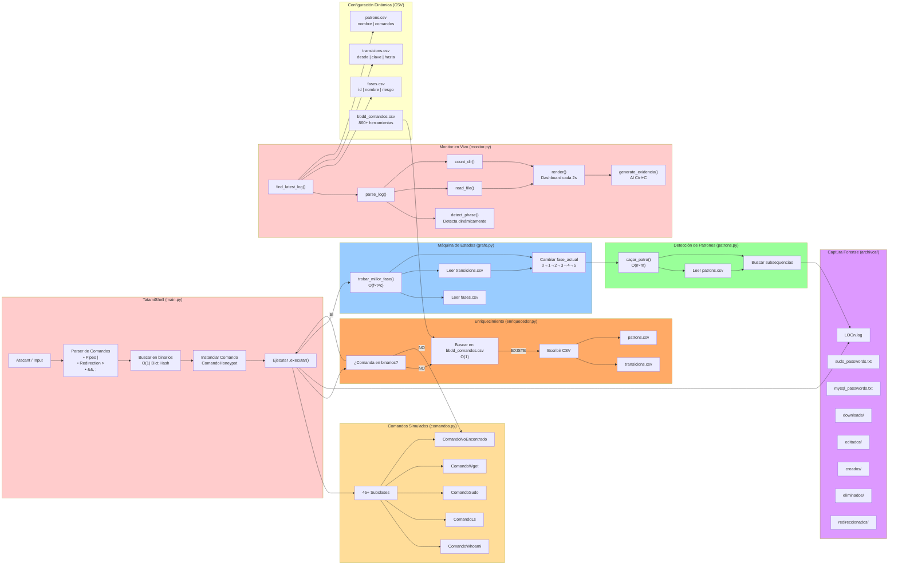

# Tatami Honeypot

Projecte de l'assignatura Anàlisi i Disseny d'Algorismes Avançats  
Grau en Ciberseguretat — ENTI UB  

Honeypot de terminal Linux simulat. Captura i analitza el comportament d'un atacant que creu haver accedit a un servidor Ubuntu real.

## Integrants del grup

- Lluc Galceran
- Ian Nogueira
- Martí Tarrasón
- Roger Vallés

---

## Com executar-lo

Requereix Python 3.10 o superior. No necessita llibreries externes.

**Terminal A — el honeypot:**
```
python main.py
```

**Terminal B — el monitor en temps real (opcional):**
```
python monitor.py
```

## Què fa

L'atacant veu un terminal Ubuntu 22.04 completament funcional. Pot navegar directoris, llegir arxius, executar comandes, intentar escalar privilegis i exfiltrar dades. Tot és simulat: cap comanda toca el sistema real.

Mentrestant, el sistema registra cada acció, captura credencials introduïdes i classifica automàticament la fase de l'atac.

## Arquitectura

El projecte es divideix en cinc mòduls Python i tres fitxers CSV de configuració:

**main.py** — Shell principal. Gestiona el bucle d'entrada, resol àlies, expandeix variables d'entorn (`$VAR`), processa pipes (`|`), cadenes (`&&`, `;`) i redireccionaments (`>`). Instancia les comandes i actualitza la màquina d'estats.

**comandos.py** — Conté totes les classes de comandes, el sistema de fitxers virtual (`VIRTUAL_FS`, `VIRTUAL_DIRS`) i les dades estàtiques de directoris (`LS_DATA`). Cada comanda hereta de `ComandoHoneypot` i implementa el seu propi mètode `executar()`.

**grafo.py** — Màquina d'estats implementada com a graf dirigit. Llegeix les fases des de `fases.csv` i les transicions des de `transicions.csv`. Defineix sis fases d'atac i les construeix dinàmicament en arrencar.

**patrons.py** — Detecció de patrons d'atac mitjançant cerca recursiva de subseqüències en l'historial de comandes. Llegeix els patrons des de `patrons.csv` i permet afegir-ne de nous en temps d'execució.

**enriquecedor.py** — Mòdul d'enriquiment automàtic. Quan s'executa una comanda desconeguda, la cerca a `bbdd_comandos.csv`. Si està registrada, afegeix automàticament la transició a `transicions.csv` i el patró a `patrons.csv` sense reiniciar el sistema.

**monitor.py** — Monitor independent que llegeix els logs en temps real, detecta la fase actual i mostra credencials capturades i activitat d'arxius. En tancar-lo genera un informe d'evidències.

## Fitxers CSV de configuració

El comportament del honeypot es controla íntegrament des de fitxers CSV, sense tocar el codi:

**fases.csv** — Defineix els sis nodes del graf: id, nom i nivell de risc.

**transicions.csv** — Defineix les arestes del graf: comanda que dispara la transició, fase d'origen i fase de destí. S'actualitza automàticament quan l'enriquidor detecta una eina coneguda.

**patrons.csv** — Llista de patrons d'atac com a seqüències de comandes. També s'actualitza automàticament per l'enriquidor.

**bbdd_comandos.csv** — Base de dades de referència amb més de 860 eines de pentesting i hacking conegudes, classificades per fase segons el framework MITRE ATT&CK. Quan l'atacant executa una comanda que no té implementació simulada, el sistema la cerca aquí i, si la troba, registra automàticament la transició i el patró corresponents.

## Flux d'una comanda desconeguda

```
atacant escriu: nmap -sV 192.168.1.1
         |
         v
ComandoNoEncontrado  -->  enriquecedor.py cerca "nmap" a bbdd_comandos.csv
         |                        |
         |              TROBAT (fase 0->1, patró "Escaneig de xarxa")
         |                        |
         v                        v
bash: nmap: command not found    transicions.csv  <-- afegeix fila
                                 patrons.csv      <-- afegeix patró
                                 monitor.py       <-- detecta la nova fase
                                                      en el següent cicle (2s)
```

Si la comanda no és a la bbdd, retorna l'error de bash estàndard sense registrar res.

## Sistema de fitxers virtual

El honeypot simula la següent estructura de directoris:

```
/home/ubuntu/
    credentials.bak --> contrasenyes de BD, SSH i API tokens
    .bash_history --> historial amb comandes sospitoses
    .ssh/id_rsa --> clau privada SSH
    .ssh/known_hosts
    server_config/
        nginx.conf
        app.conf --> cadena de connexió a BD amb credencials
    backups/
        db_backup.sql.gz

/etc/
    crontab --> cronjob sospitós cada 5 minuts
    passwd / shadow
    hosts

/var/log/
    auth.log --> intents de sudo i logins SSH
    syslog

/proc/
    version / cpuinfo
```

Els arxius són accessibles amb `cat`, `grep`, `tail`, `head` i `base64`. Els directoris són navegables amb `cd` i `ls`.

## Comandes disponibles

| Categoria | Comandes |
|---|---|
| Navegació | `ls`, `ll`, `la`, `cd`, `pwd`, `find` |
| Lectura | `cat`, `head`, `tail`, `grep`, `base64` |
| Edició | `vi`, `touch`, `mkdir`, `rm`, `cp`, `mv` |
| Sistema | `whoami`, `id`, `uname`, `hostname`, `uptime`, `env`, `ps`, `df`, `free` |
| Xarxa | `ip`, `ifconfig`, `netstat`, `ss`, `ssh`, `nc`, `wget`, `curl` |
| Sessió | `who`, `w`, `last`, `history`, `alias` |
| Serveis | `systemctl`, `service`, `docker`, `mysql`, `crontab` |
| Privilegis | `sudo`, `chmod` |
| Altres | `echo`, `python3`, `apt`, `cowsay`, `sl` |

Suporta pipes (`|`), encadenat (`&&`, `;`), redireccionament (`>`), expansió de variables (`$VAR`) i tab completion.

Qualsevol altra comanda retorna `command not found` i és processada per l'enriquidor.

## Fases de l'atac (graf d'estats)

Les fases es defineixen a `fases.csv` i les transicions a `transicions.csv`. Configuració inicial:

| Fase | Comandes que l'activen |
|---|---|
| Reconeixement | `whoami`, `id`, `uname`, `hostname` |
| Enumeració | `ls`, `ps`, `find`, `netstat`, `ss`, `env`, `history`, `docker`, `systemctl` |
| Escalada | `sudo`, `chmod`, `bash`, `python3` |
| Lectura de dades | `cat`, `grep`, `vi`, `base64`, `mysql` |
| Exfiltració | `wget`, `curl`, `nc`, `ssh` |

El graf s'amplia automàticament quan l'enriquidor detecta eines noves a `bbdd_comandos.csv`.

## Captures forenses

Tot el que fa l'atacant queda guardat a la carpeta `archivos/`:

```
archivos/
    LOG1.log --> historial complet amb timestamps
    sudo_passwords.txt --> contrasenyes introduïdes a sudo
    mysql_passwords.txt --> contrasenyes introduïdes a mysql
    downloads/ --> arxius descarregats amb wget
    editados/ --> arxius modificats amb vi
    creados/ --> arxius creats amb touch
    eliminados/ --> arxius esborrats amb rm
    redireccionados/ --> arxius creats amb >
    Evidencia_LOG1.txt --> informe generat en tancar el monitor
```

## Monitor en temps real

`monitor.py` s'executa en una terminal separada i es refresca cada 2 segons. Mostra:

- Fase d'atac detectada automàticament (llegeix `transicions.csv` i `fases.csv` en cada cicle)
- Credencials capturades en temps real
- Activitat sobre arxius
- Comandes sospitoses amb timestamp
- Últimes 10 comandes executades

En tancar-lo amb Ctrl+C genera `Evidencia_LOGX.txt` amb l'informe complet de la sessió.

## Complexitat algorísmica

| Operació | Complexitat |
|---|---|
| Cerca de comanda a `binarios` | O(1) — dict hash |
| Cerca a `bbdd_comandos.csv` | O(1) — dict hash carregat en memòria |
| Canvi d'estat al graf | O(k) — k = nombre de transicions del node |
| Detecció de patró a `patrons.py` | O(n·m) — n comandes, m longitud del patró |
| Recorregut del graf (informe) | O(V+E) |
| Construcció de `ls -l` | O(e) — e = entrades extra del directori |
| Detecció de fase al monitor | O(t) — t = nombre de transicions al CSV |

## Demo

Vídeo de demostració del projecte en funcionament, amb un atacant simulat navegant el honeypot i el monitor detectant les fases en temps real.

[Veure vídeo de demostració](https://drive.google.com/file/d/1IBjRYTE_TkggKPf0qe4dZZCCn1TweKUI/view?usp=drive_link)

## IA

S'ha utilitzat IA per a tasques específiques no funcionals:
- Generació de timestamps i banners visuals (detallat en comentaris del codi)
- Formatació de sortides del monitor

La lògica, algoritmes i funcionalitat del honeypot són completament originals.

## Diagrama README


